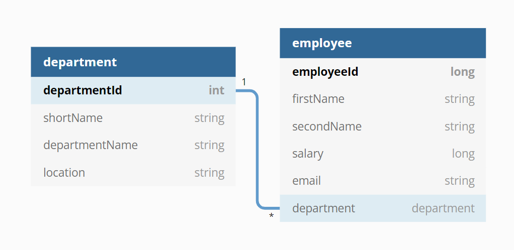

# Employee-Department Management REST API
***

This is the example project that shows you how to build Spring boot REST API which has basic CRUD APIs using Spring JPA.


## Features

- Create department
- List all departments
- Fetch single department by id
- Update department by id
- Delete department by id
- Delete all departments
- Create employee
- List all employees
- Fetch single employee by id
- Update employee by id
- Delete employee by id
- Delete all employees

## Pre-requisites
- Install Spring STS or any other IDE
- Install **Postman** plugin/app in Chrome for testing Rest calls

## Installation (How to run this project?)

Download the project and follow any of these two methods
* Method-1:
    * Open CMD and change directory to "target" folder
    * run this command `java -jar spring-edm-crud-app-0.0.1-SNAPSHOT.jar`
* Method-2:
  * And import it to any IDE
  * Open the class `SpringEdmCrudAppApplication.java` 
  * run it as Java application


## Invoking the Rest Controller
- GET `/departments` Gets all the departments http://localhost:8080/departments
- GET `/departments/id` Get the department http://localhost:8080/departments/1
- POST `/departments` Create new department http://localhost:8080/departments
- PUT `/departments/id` Update the department http://localhost:8080/departments
- DELETE `/departments` Deletes all the departments http://localhost:8080/departments
- DELETE `/departments/id` Deletes the department http://localhost:8080/departments/3
- GET `/employees` Gets all the employees http://localhost:8080/employees
- GET `/employees/id` Get the employee http://localhost:8080/employees/1
- POST `/employees` Create new employee http://localhost:8080/employees
- PUT `/employees/id` Update the employee http://localhost:8080/employees
- DELETE `/employees` Deletes all the employees http://localhost:8080/employees
- DELETE `/employees/id` Deletes the employee http://localhost:8080/employees/3

## API Reference

We will create an Employee-Department REST API, following are the rest end points

> ### ***Make sure to insert the department object in department table before inserting the employee object using that department in its department column as foreign key***   

### Schema Diagram

```
Table department {
  departmentId int [pk],
  shortName string,
  departmentName string,
  location string
}

Table employee {
  employeeId long [pk]
  firstName string
  secondName string
  salary long
  email string [unique]
  department department
 }
```
> ## Here are some examples of requests and responses
### Get all employees

```http
  GET /localhost:8080/employees
```

#### Sample Response

```json
  [
    {
      "employeeId": 1,
      "firstName": "Utkarsh",
      "lastName": "Sinha",
      "salary": 25000,
      "email": "utkarsh@paytmemail.com",
      "department": {
        "departmentId": 1,
        "shortName": "D&GV",
        "departmentName": "Deals and Gift Vouchers",
        "location": "Noida"
      }
    },
      {
        "employeeId": 2,
        "firstName": "Aman",
        "lastName": "Singh",
        "salary": 25000,
        "email": "aman@paytmemail.com",
        "department": {
          "departmentId": 2,
          "shortName": "PMall",
          "departmentName": "Paytm Mall",
          "location": "Bengaluru"
        }
      },
      {
        "employeeId": 3,
        "firstName": "Jason",
        "lastName": "Smith",
        "salary": 25000,
        "email": "jason@paytmemail.com",
        "department": {
          "departmentId": 1,
          "shortName": "D&GV",
          "departmentName": "Deals and Gift Vouchers",
          "location": "Noida"
        }
      }
]
```

### Get single employee

```http
  GET /localhost:8080/employees/${id}
```

| Parameter | Type   | Description                       |
| :-------- |:-------| :-------------------------------- |
| `id`      | `Long` | **Required**. Id of employee to fetch |

#### Sample Response

```json
{
  "employeeId": 1,
  "firstName": "Utkarsh",
  "lastName": "Sinha",
  "salary": 25000,
  "email": "utkarsh@paytmemail.com",
  "department": {
    "departmentId": 1,
    "shortName": "D&GV",
    "departmentName": "Deals and Gift Vouchers",
    "location": "Noida"
  }
}
```

### Save employee

```http
  POST /localhost:8080/employees
```
| Parameter | Type     | Description                       |
| :-------- | :------- | :-------------------------------- |
| `employee reference`      | `Employee` | **Required**. Request body of employee |

#### Sample Request

```json
{
  "employeeId": 1,
  "firstName": "Utkarsh",
  "lastName": "Sinha",
  "salary": 25000,
  "email": "utkarsh@paytmemail.com",
  "department": {
    "departmentId": 1,
    "shortName": "D&GV",
    "departmentName": "Deals and Gift Vouchers",
    "location": "Noida"
  }
}
```
##### OR
```json
{
  "employeeId": 1,
  "firstName": "Utkarsh",
  "lastName": "Sinha",
  "salary": 25000,
  "email": "utkarsh@paytmemail.com",
  "department": {
    "departmentId": 1
  }
}
```

### Update employee

```http
  PUT /localhost:8080/${id}
```
| Parameter | Type       | Description                       |
| :-------- |:-----------| :-------------------------------- |
| `id`      | `Long`     | **Required**. Id of employee to update |
| `employee reference`      | `Employee` | **Required**. Request body of employee |

#### Sample Request
```json
{
  "employeeId": 1,
  "firstName": "Utkarsh",
  "lastName": "Sinha",
  "salary": 25000,
  "email": "utkarsh@paytmemail.com",
  "department": {
    "departmentId": 1,
    "shortName": "D&GV",
    "departmentName": "Deals and Gift Vouchers",
    "location": "Noida"
  }
}
```
##### OR
```json
{
  "employeeId": 1,
  "firstName": "Utkarsh",
  "lastName": "Sinha",
  "salary": 25000,
  "email": "utkarsh@paytmemail.com",
  "department": {
    "departmentId": 1
  }
}
```

### Delete employee

```http
  DELETE /localhost:8080/${id}
```
| Parameter | Type   | Description                       |
| :-------- |:-------| :-------------------------------- |
| `id`      | `Long` | **Required**. Id of employee to delete |


## Author

- ### [Utkarsh Sinha](https://www.linkedin.com/in/utkarsh-sinha116/)


  